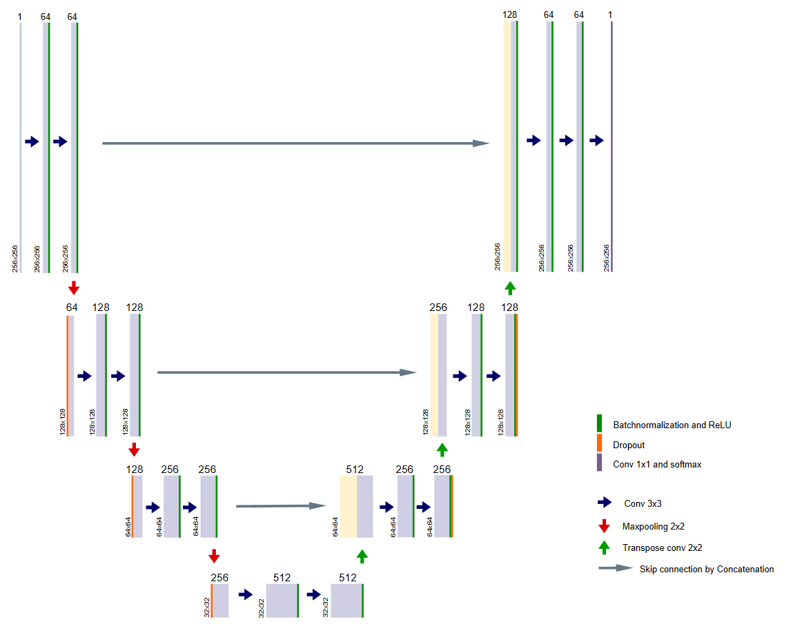
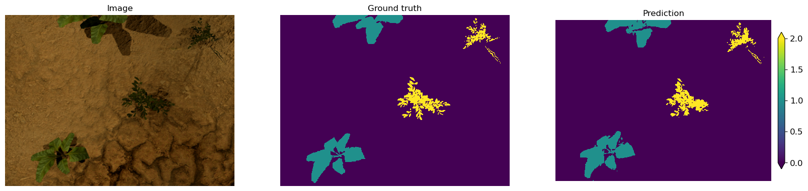
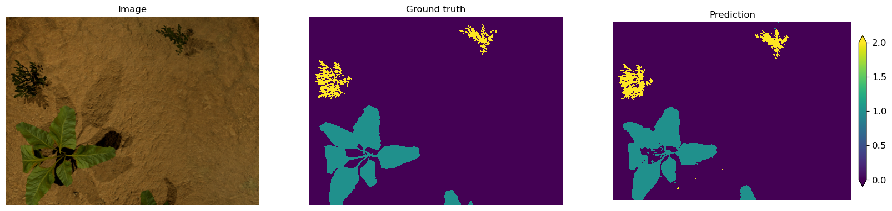

# SugNet 

A semantic segmentation U-Net like convnet trained on synthetic data for sugar beets crop/weeds detection.

## The dataset
The data used to train the model is a realistic synthetic dataset of *360x480* sugar beets crop/weeds images with corresponding annotations generated for **selective weeding** tasks (Accurately detect plants and distinguish them between crop and weeds) in agriculture robotics as having large agricultural datasets with pixel-level annotations is extremely time consuming.  
The dataset and the related work can be found [here](http://www.diag.uniroma1.it//~labrococo/fds/syntheticdatasets.html).
> Only **Synthetic SugarBeet Random Weeds** dataset is used for this task.

The original images are converted to grayscale, rescaled and cropped into 4 *256x256* patches.

## Model architecture
SugNet is U-shaped architecture that consists of a specific encoder-decoder scheme: The encoder reduces the spatial dimensions in every layer and increases the channels. On the other hand, the decoder increases the spatial dims while reducing the channels. In the end, the spatial dims are restored to make a prediction for each pixel in the input image.

- **Encoder (left side):**  
It consists of the repeated application of two 3x3 convolutions. Each conv is followed by a ReLU activation, batch normalization and a SAME 2x2 max pooling operation. Again, at each downsampling step, we double the number of feature channels, while we cut in half the spatial dimensions.

- **Decoder path (right side):**  
Every step in the expansive path consists of an upsampling of the feature map followed by a 2x2 transpose convolution, which halves the number of feature channels. We also have a concatenation with the corresponding feature map from the contracting path, and two 3x3 convolutional layers (each followed by ReLU + batch normalization). At the final layer, a 1x1 convolution is used to map the channels to the desired number of classes.

    
  
## Some examples of the segmentation
 

  

